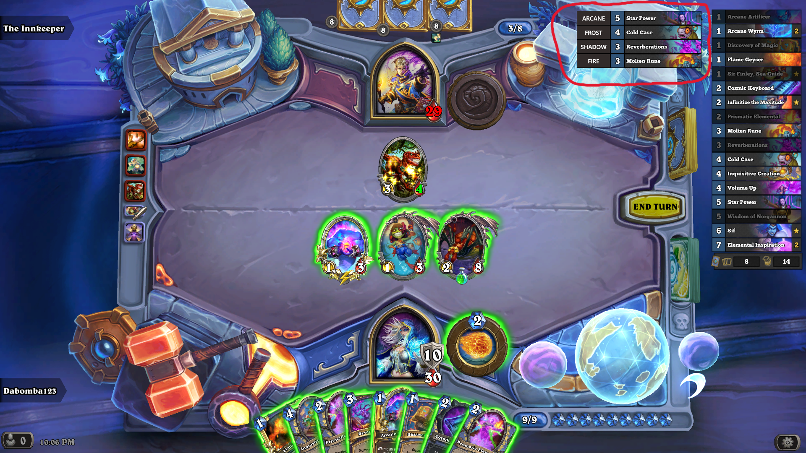

# HDT-Spell-School-Tracker-Plugin

A basic Hearthstone Deck Tracker plugin that displays a list of all currently unique casted spell schools. It will not display cards of spell schools that have already been cast. Works with all current cards (as of Hearthstone Patch 27.2).

This is the first time I've seen code of a HDT plugin and credit for the initial logic/syntax goes to:
https://github.com/HearthSim/Hearthstone-Deck-Tracker/wiki/Creating-Plugins - Basic Tutorial  
https://github.com/slicedbread/HDT-SpellSchoolCounter-Plugin - Old Spell School Plugin   

Got most of the idea/code syntax from the plugin above that no longer worked with the current standard cards, and originally worked only when highlighting certain cards from your hand. Also added the spell school type next to the card since it's not always easy to determine a spell's type by only its name.
